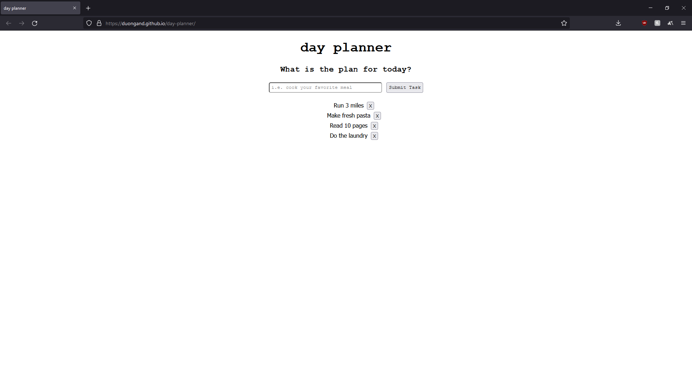

## day-planner

day-planner provides the user a quick and easy tool to keep their day on track. 

[Live Demo](https://duongand.github.io/day-planner/)

### Summary
Have you ever felt unproductive halfway through the day? Did you nap for more than the recommended 30 minuntes? `day-planner` is an easy tool to plan out your day and grasp change. A laid out plan alleviates the guessing and feeling of what should be done. Nothing is more satisfying than knowing that incremental progression was made.

### Author
* **Anderson Duong** - Full-Stack Developer